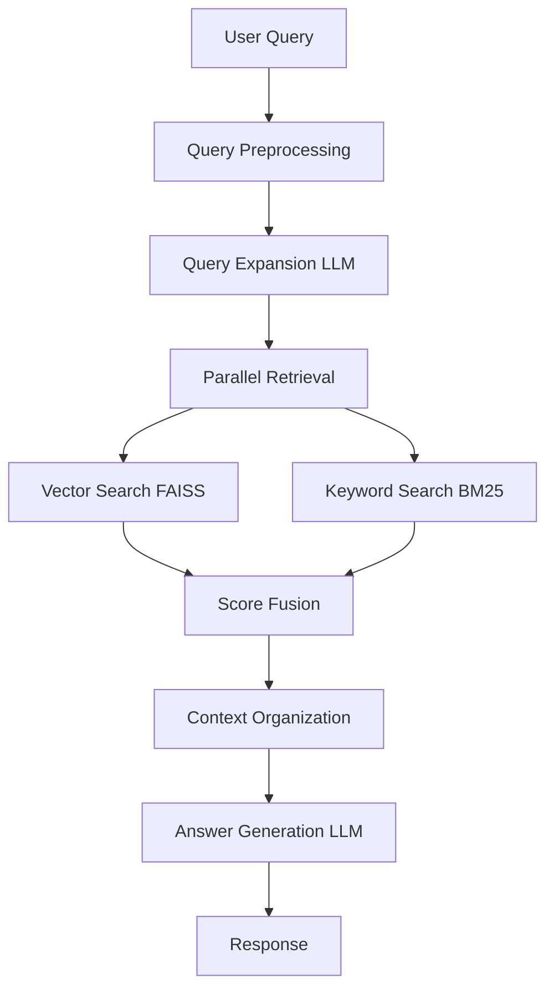

# Modular RAG System with Qwen Models

A comprehensive, industrial-grade Retrieval-Augmented Generation (RAG) system built with a modular architecture, featuring hybrid retrieval strategies and advanced query processing.

## 🌟 Features

### 🔍 **Hybrid Retrieval Strategy**
- **FAISS Vector Retrieval**: Semantic similarity search using Qwen3-Embedding-0.6B (1024-dim, customizable 32-1024)
- **BM25 Keyword Retrieval**: Traditional term-frequency based matching
- **Intelligent Score Fusion**: Configurable weighted combination of retrieval results

### 🤖 **Smart Query Processing**
- **Query Expansion**: LLM-powered query rewriting using Qwen3-0.6B
- **Context Organization**: Intelligent document structuring for optimal LLM input
- **Adaptive Generation**: Context-aware response generation

### 🏭 **Industrial-Grade Design**
- **Modular Architecture**: Clean separation of concerns with independent components
- **Comprehensive Logging**: Advanced logging with loguru for debugging and monitoring
- **Robust Error Handling**: Complete exception handling and boundary condition checks
- **Efficient Caching**: Multi-level caching for embeddings, indexes, and models
- **Performance Monitoring**: Detailed metrics and system statistics

## 📁 Project Structure

```
modular_rag/
├── config.py              # Configuration management with loguru setup
├── dataset_processor.py   # Data loading and preprocessing
├── embedding_processor.py # Text embedding generation
├── vector_retriever.py    # FAISS-based vector search
├── bm25_retriever.py      # BM25 keyword search
├── hybrid_retriever.py    # Combined retrieval strategy
├── query_processor.py     # Query expansion and processing
├── context_organizer.py   # Context formatting for LLM
├── rag_pipeline.py        # Main orchestrator
├── requirements.txt       # Python dependencies
├── example_modular.py     # Usage examples
└── __init__.py            # Package initialization
```

## 🚀 Quick Start

### 1. Installation

```bash
# Install dependencies
pip install -r requirements.txt

# For GPU support (recommended)
pip uninstall faiss-cpu
pip install faiss-gpu
```

### 2. Basic Usage

```python
from config import RAGConfig
from rag_pipeline import RAGPipeline

# Create configuration
config = RAGConfig(
    device="cuda",          # Use GPU if available
    embedding_dim=512,      # Embedding dimension
    top_k_retrieval=5       # Number of documents to retrieve
)

# Initialize RAG system
rag = RAGPipeline(config)
rag.initialize()  # First run downloads models and dataset

# Query the system
result = rag.query("What is artificial intelligence?")
print(f"Answer: {result['answer']}")
print(f"Processing time: {result['processing_time']:.2f}s")
```

### 3. Configuration File Usage

```python
from config import load_config

# Load from YAML file
config = load_config("config.yaml")
rag = RAGPipeline(config)
```

### 4. Interactive Demo

```bash
python example_modular.py
# Select option 5 for interactive demo
```

## ⚙️ Configuration

### Core Parameters

| Parameter | Default | Description |
|-----------|---------|-------------|
| `embedding_dim` | 1024 | Embedding dimension (32-1024) |
| `top_k_retrieval` | 10 | Number of documents to retrieve |
| `bm25_weight` | 0.3 | BM25 retrieval weight |
| `embedding_weight` | 0.7 | Vector retrieval weight |
| `chunk_size` | 512 | Document chunk size |
| `max_context_length` | 4096 | Maximum context length |
| `device` | "auto" | Computing device (cpu/cuda) |

### Environment Variables

```bash
# Override config with environment variables
export RAG_DEVICE=cuda
export RAG_EMBEDDING_DIM=768
export RAG_TOP_K_RETRIEVAL=15
```

### YAML Configuration

```yaml
models:
  llm_model_name: "Qwen/Qwen3-0.6B"
  embedding_model_name: "Qwen/Qwen3-Embedding-0.6B"

retrieval:
  top_k_retrieval: 10
  bm25_weight: 0.3
  embedding_weight: 0.7

system:
  device: "cuda"
  log_level: "INFO"
  cache_dir: "./cache"
```

## 🔧 Component Details

### 1. **DatasetProcessor**
- Loads Simple Wikipedia dataset (23.9M words)
- Intelligent document chunking with overlap
- Data quality filtering and validation

### 2. **EmbeddingProcessor**
- Qwen3-Embedding-0.6B model integration
- Batch processing with memory optimization
- Support for custom embedding dimensions

### 3. **VectorRetriever**
- FAISS index construction and management
- Multiple index types (Flat, IVF, HNSW)
- GPU acceleration support

### 4. **BM25Retriever**
- Optimized keyword-based retrieval
- Configurable BM25 parameters (k1, b)
- Multi-language stopword support

### 5. **HybridRetriever**
- Score normalization and fusion
- Result deduplication and ranking
- Configurable retrieval strategies

### 6. **QueryProcessor**
- LLM-powered query expansion
- Query quality analysis
- Caching for performance

### 7. **ContextOrganizer**
- Intelligent document organization
- Length control and truncation
- Multiple formatting strategies

### 8. **RAGPipeline**
- End-to-end workflow orchestration
- Performance monitoring
- System state management

## 🎯 Performance Optimization

### Memory Optimization
```python
config = RAGConfig(
    embedding_dim=512,      # Reduce embedding size
    chunk_size=256,         # Smaller chunks
    top_k_retrieval=5,      # Fewer documents
    max_context_length=2048 # Shorter context
)
```

### Speed Optimization
```python
config = RAGConfig(
    device="cuda",          # Use GPU
    batch_size=64,          # Larger batches
    enable_cache=True       # Enable caching
)
```

## 📊 Performance Benchmarks

| Hardware | Initialization | Query Time | Memory Usage |
|----------|----------------|------------|--------------|
| CPU (8GB RAM) | ~15 min | ~5s | ~4GB |
| GPU (RTX 3080) | ~8 min | ~2s | ~6GB |

## 🔍 Advanced Usage

### Custom Retrieval Strategies

```python
# Vector-only retrieval
result = rag.query("AI ethics", retrieval_strategy="vector_only")

# BM25-only retrieval  
result = rag.query("machine learning", retrieval_strategy="bm25_only")

# Hybrid retrieval (default)
result = rag.query("deep learning", retrieval_strategy="hybrid")
```

### Batch Processing

```python
queries = [
    "What is machine learning?",
    "How do neural networks work?",
    "What are the applications of AI?"
]

results = rag.batch_query(queries)
for result in results:
    print(f"Q: {result['query']}")
    print(f"A: {result['answer']}\n")
```

### Component Access

```python
# Direct component access for customization
rag.initialize()

# Access individual components
embeddings = rag.embedding_processor.encode_texts(["test"])
vector_results = rag.vector_retriever.search(embeddings, k=5)
bm25_results = rag.bm25_retriever.search("test query", k=5)
```

### System Monitoring

```python
# Get system statistics
stats = rag.get_system_statistics()
print(f"Total queries: {stats['performance']['total_queries']}")
print(f"Average time: {stats['performance']['avg_query_time']:.3f}s")
print(f"Memory usage: {stats['performance']['memory_usage_gb']:.1f}GB")

# Performance optimization
rag.optimize_performance()
```

## 🐛 Troubleshooting

### Common Issues

1. **Out of Memory**
   ```python
   # Reduce memory usage
   config.embedding_dim = 512
   config.chunk_size = 256
   config.batch_size = 16
   ```

2. **CUDA Errors**
   ```python
   # Use CPU fallback
   config.device = "cpu"
   ```

3. **Slow Model Download**
   ```bash
   # Use HuggingFace mirror
   export HF_ENDPOINT=https://hf-mirror.com
   ```

4. **Cache Issues**
   ```python
   # Force rebuild
   rag.initialize(force_rebuild=True)
   
   # Clear cache
   rag.clear_cache()
   ```

### Debug Mode

```python
import logging
from loguru import logger

# Enable debug logging
logger.remove()
logger.add(sys.stderr, level="DEBUG")

# Run with detailed logs
rag.initialize()
```

## 🔄 System Workflow



## 📋 Requirements

- Python 3.8+
- PyTorch 2.0+
- CUDA (optional, for GPU acceleration)
- 8GB+ RAM (16GB+ recommended)
- 10GB+ disk space

## 🤝 Contributing

1. Follow Google Python Style Guide
2. Add comprehensive docstrings (PEP 257)
3. Include type annotations
4. Write tests for new features
5. Update documentation

## 📄 License

MIT License - see LICENSE file for details.

## 🙏 Acknowledgments

- **Qwen Team**: For the excellent LLM and embedding models
- **HuggingFace**: For the transformers library and model hub
- **FAISS Team**: For efficient vector search
- **Simple Wikipedia**: For the high-quality dataset

## 📞 Support

- **GitHub Issues**: For bug reports and feature requests
- **Documentation**: Comprehensive inline documentation
- **Examples**: Multiple usage examples provided

---

**Built with ❤️ for the AI research community**

*Last updated: October 29, 2025*